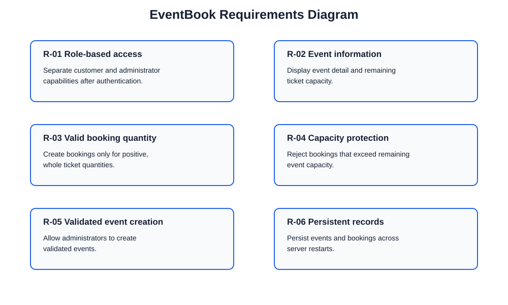
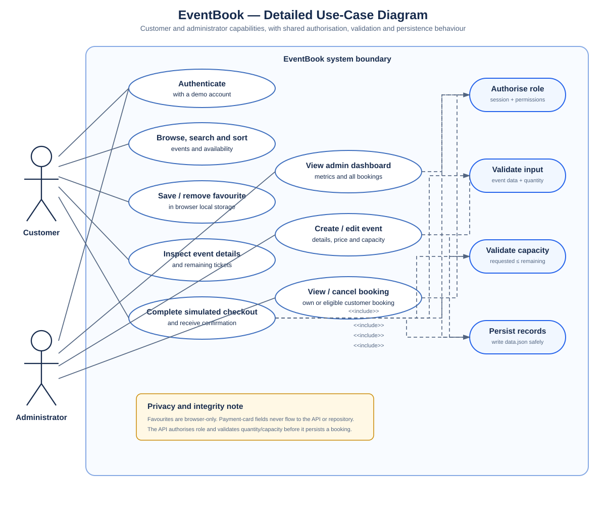
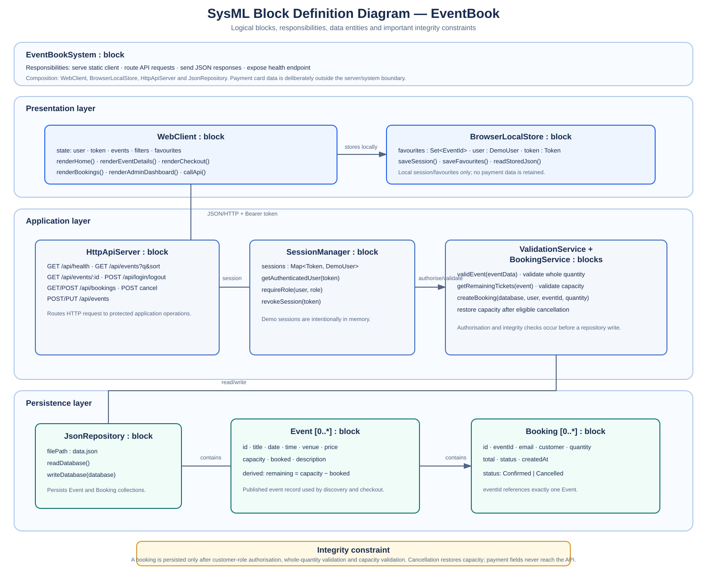
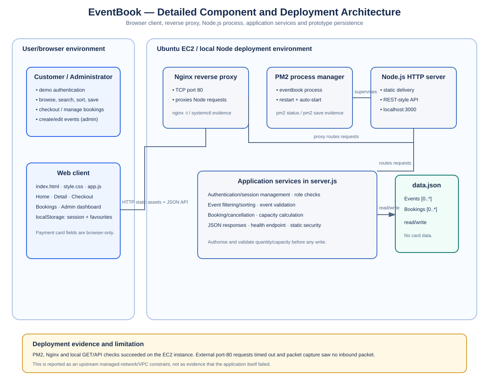
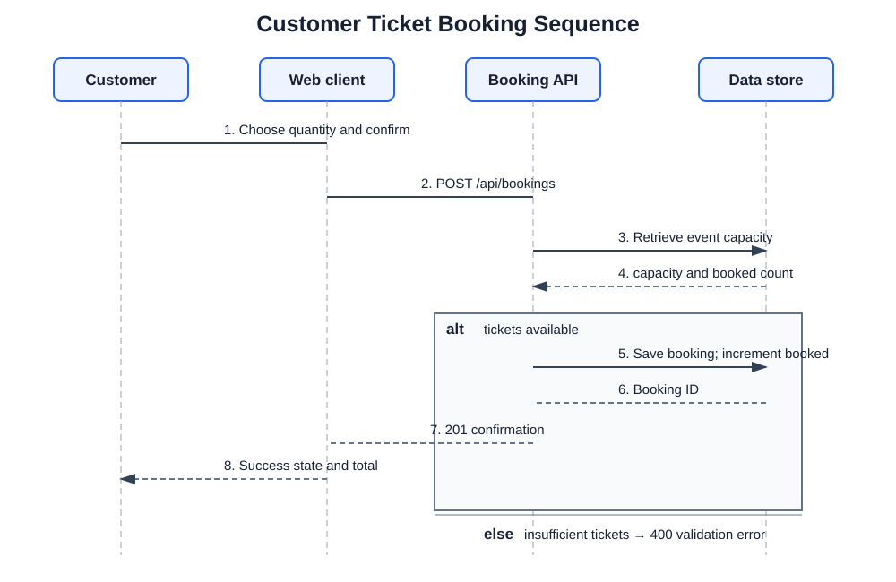
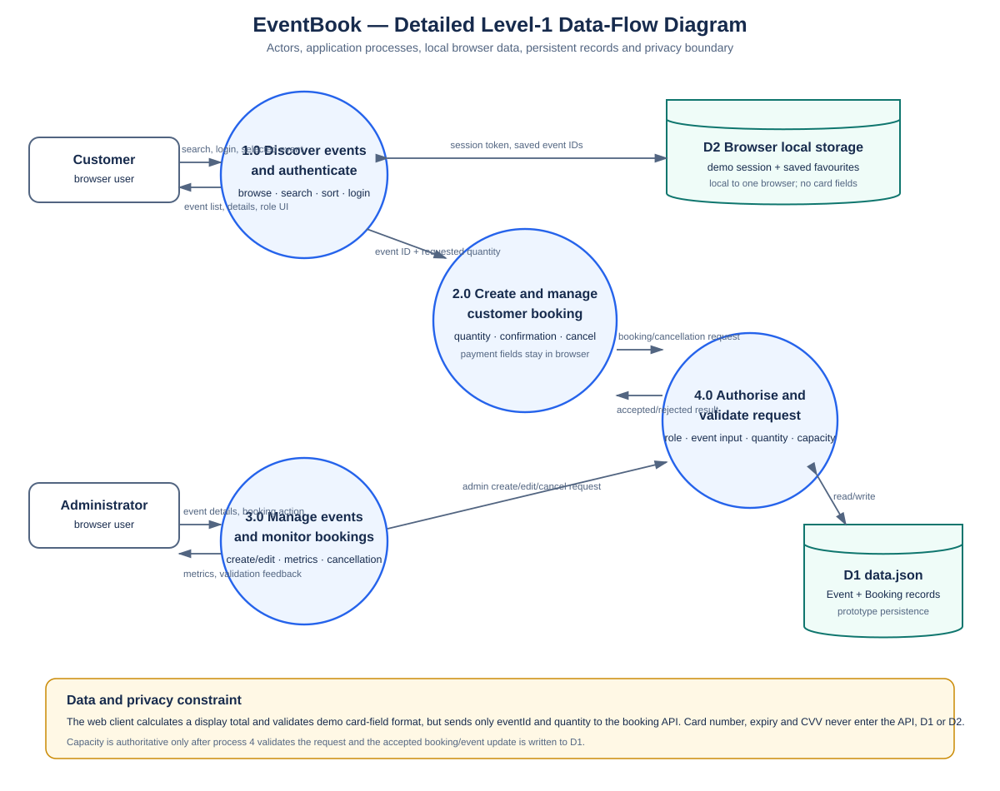

# IFN636 Assessment 1 — EventBook Ticket Booking System

> **Submission preparation note.** Replace every bracketed placeholder on the cover page, paste the labelled screenshots in the evidence appendix, and update the Git commit hash for the final local enhancement before exporting this report to PDF. Captions must explain what the evidence proves; do not include passwords, private keys, unrelated browser tabs, or personal data.

## Cover page

| Item | Submission value |
|---|---|
| Assessment | IFN636 Assessment 1 — Software Requirements Analysis and Design |
| System | **EventBook — Event Ticket Booking System** |
| Student name, ID and tutor | **[replace]** |
| GitHub repository | https://github.com/TrixteR-XO/event-ticket-booking-system |
| Jira project | https://likhitraj333.atlassian.net/jira/software/projects/EVENT/summary |
| Jira board | https://likhitraj333.atlassian.net/jira/software/projects/EVENT/boards/34 |
| EC2 instance | `i-065c5e4c95dbba221` |
| EC2 public IPv4 used for deployment test | `3.106.245.243` |
| Figma view-only URL | **[replace]** |
| Draw.io / PlantUML diagram URL | **[replace]** |
| Submission date | **[replace]** |

---

## 1. Executive summary

EventBook is a responsive web prototype for discovering local events, booking general-admission tickets, and administering published events. It was designed for small organisers who currently rely on social-media messages and spreadsheets. Those manual processes can delay confirmations, hide remaining capacity, and cause overbooking.

The prototype provides two role-specific experiences:

- **Customer:** browse, search, sort, save events locally, inspect event details, complete a clearly labelled simulated checkout, receive a booking reference, view bookings, and cancel eligible bookings.
- **Administrator:** log in with an administrator role, view event/booking/revenue indicators, create a new event, edit an existing event, and view or cancel all bookings.

The implementation uses an HTML/CSS/JavaScript web client, a Node.js HTTP API, in-memory demo sessions, and a JSON persistence file. Server-side validation is deliberately used for ticket quantity, capacity, role access, and event values so that a user cannot bypass the browser UI to overbook an event.

---

## 2. Problem, stakeholders and scope

### 2.1 Problem statement

Local event organisers need a lightweight way to publish events and accept reservations. A spreadsheet-based approach does not automatically calculate capacity, create a confirmation, or restrict administrative changes. EventBook addresses this by keeping event and booking information in one application and validating each booking before it is saved.

### 2.2 Stakeholders

| Stakeholder | Need from EventBook |
|---|---|
| Customer / attendee | Find relevant events, understand price and availability, book safely, and manage their own reservations. |
| Event administrator | Create or correct event details, monitor bookings and remaining capacity, and resolve cancellations. |
| Event organiser | Reduce manual tracking effort and prevent accidental overbooking. |
| Unit marker | Inspect requirements, diagrams, agile evidence, code quality, testing, and deployment evidence. |

### 2.3 Scope and constraints

**In scope:** demo role-based sign-in, responsive event discovery, keyword search, sorting, local saved events, event details, simulated payment fields, booking confirmation/cancellation, server-side capacity validation, administrator event creation/editing, booking metrics, automated tests, GitHub Actions CI, and EC2/PM2 deployment evidence.

**Out of scope:** a real payment gateway, card-data storage, public registration, password reset, email/SMS notifications, venue seating maps, attendee check-in, a production database, multi-organiser tenancy, and concurrent transactional booking protection.

**Assumptions:** each event is general admission; the supplied customer and administrator accounts are assessment-only demo accounts; payment inputs are validated only in the browser and never sent to or stored by the API; event organisers maintain the accuracy of event details.

### 2.4 Success measures

The prototype is successful when a customer can find an event and make a booking in under three minutes, an over-capacity request is rejected by the server, an administrator can publish and amend valid event data, and booking/event records remain in `data.json` after a server restart. EC2 process and reverse-proxy health are also demonstrated with PM2, Nginx and local HTTP checks. Public reachability must be recorded honestly because the deployed instance experienced an upstream managed-network timeout during external testing.

---

## 3. Requirements and traceability

### 3.1 Functional requirements

| ID | Requirement | Priority | Acceptance measure |
|---|---|---|---|
| R-01 | The system shall authenticate a customer or administrator and show role-appropriate functions. | Must | Valid credentials show customer or administrator navigation; invalid credentials display a helpful error. |
| R-02 | The system shall display event title, date/time, venue, price and remaining capacity. | Must | Event cards and details contain all fields and availability indicators. |
| R-03 | The system shall accept only a positive whole ticket quantity and calculate the booking total. | Must | Invalid values are rejected; checkout total updates as ticket quantity changes. |
| R-04 | The server shall reject booking requests exceeding remaining capacity. | Must | A request with `booked + quantity > capacity` returns an understandable error and does not create a booking. |
| R-05 | The system shall allow an administrator to create and edit validated event details. | Must | Required fields, whole positive capacity and non-negative price are enforced. |
| R-06 | The system shall persist event and booking records. | Must | The JSON repository is read and written by create, update, booking and cancellation operations. |
| R-07 | The system shall show booking confirmation and allow authorised cancellation. | Should | A booking reference/total is shown; eligible cancellation restores capacity. |

### 3.2 Post-MVP usability enhancements

The following refinements strengthen usability without changing the core assessment scope: keyword search; availability and price sorting; availability progress bars; saved events stored in browser local storage; demo-account shortcuts; customer/admin booking metrics; safer cancellation confirmation; toast feedback; responsive layout; and a copy-link control. These features provide richer high-fidelity screenshot evidence and make common actions easier to find.

### 3.3 Requirements/design traceability matrix

| Requirement | Jira story / task | Design and implementation element | Evidence to capture |
|---|---|---|---|
| R-01 | EVENT-4; EVENT-9 | Login endpoint, demo sessions, role checks, role-specific navigation | Customer and administrator navigation after login; invalid-login error |
| R-02 | EVENT-5; EVENT-10 | Event API, event cards, event-detail screen, availability bar | Home screen and event-details screen |
| R-03 | EVENT-6; EVENT-13 | Checkout quantity control, calculated order summary, booking confirmation | Checkout with changed quantity; confirmation reference and total |
| R-04 | EVENT-6; EVENT-12 | `createBooking`, remaining-ticket calculation, server error response | Over-capacity validation result and automated test output |
| R-05 | EVENT-7; EVENT-15 | Create/edit form, `validEvent`, admin dashboard | Admin create/edit screen and validation error |
| R-06 | EVENT-6/7; EVENT-14 | `data.json` repository, read/write helpers, cancellation update | `data.json`/terminal persistence evidence after restart |
| R-07 | EVENT-11; EVENT-14 | Confirmation receipt, booking history, cancellation confirmation | My Bookings screen before/after cancellation |
| Quality and delivery | EVENT-17; EVENT-18 | Node test suite, GitHub Actions workflow, PM2/Nginx deployment process | `npm test`, Actions run, PM2/Nginx/local curl output |

---

## 4. Agile project management and Jira evidence

### 4.1 Jira project structure

The final assessment project is the fresh Jira project **EventBook Ticket Booking System (`EVENT`)**, rather than the earlier experimental `SCRUM` project. This avoids the old board/list-view configuration issue and provides a clean evidence trail.

| Jira item | Key | Status/evidence |
|---|---|---|
| Epic — Authentication and Role Access | EVENT-1 | Child delivery item complete |
| Epic — Event Discovery and Booking | EVENT-2 | Child delivery items complete |
| Epic — Quality, CI and EC2 Delivery | EVENT-3 | Child delivery items complete |
| Epic — Administrator Event Management | EVENT-19 | Child delivery items complete |
| Customer/admin login | EVENT-4 | Done |
| Browse event details and availability | EVENT-5 | Done |
| Simulated checkout | EVENT-6 | Done |
| Admin create/edit event | EVENT-7 | Done |
| Admin view all event bookings | EVENT-8 | Done |
| Customer view/cancel bookings | EVENT-11 | Done |
| Implementation, validation, testing, CI and EC2 evidence tasks | EVENT-9, EVENT-10, EVENT-12 to EVENT-18 | Done |

At the time of evidence capture, the Jira summary showed **15 completed delivery work items from 19 total items**. The remaining four items are the structural epics; their progress is shown as 100% because their child work is complete.

### 4.2 Sprint evidence

`EVENT Sprint 1` is configured for **30 August to 13 September 2026**. It contains the six user stories, all moved to the **Done** column. Keep this sprint active while taking screenshots so that the completed cards remain visible on the board. Do not click **Complete sprint** until after collecting Board evidence.

### 4.3 Iteration and change log

| Iteration | Planned work | Outcome |
|---|---|---|
| 1 — Design and foundation | Requirements, wireframes, data model, authentication and event list | Core customer/admin roles and event listing were established. |
| 2 — Booking and administration | Server-side capacity validation, checkout, bookings, cancellation, create/edit event | End-to-end customer booking and administrator management workflows were implemented. |
| 3 — Quality and usability refinement | Search/sort, saved events, responsive styling, metrics, test expansion and evidence documentation | The site became more readable and usable; four automated tests pass. |

| Change | Reason | Affected artefacts |
|---|---|---|
| Server-side capacity validation | Browser-only validation can be bypassed. | R-03/R-04, booking endpoint, test suite, sequence diagram |
| Simulated checkout | Demonstrates a realistic booking journey without storing payment information. | R-03/R-07, checkout and confirmation screens |
| Admin edit workflow | Administrators need to correct event details after publication. | R-05, dashboard, create/edit form |
| Search, sort and saved events | Supports event discovery and makes the customer UI more useful. | Home screen, browser local storage, high-fidelity prototype |
| Metrics and progress indicators | Improves visibility of ticket availability and administrator oversight. | Customer cards, booking view, admin dashboard |

---

## 5. System analysis and design

### 5.1 SysML-style requirements view



**Figure 1.** SysML-style requirements diagram showing the seven core functional requirements and their relationship to customer and administrator workflows.

### 5.2 Use-case view



**Figure 2.** Use-case diagram identifying Customer and Administrator actors, core customer booking use cases, administration use cases, validation and persistence inclusions.

### 5.3 Block definition / logical architecture view



**Figure 3.** Detailed SysML block definition diagram. The Web Client calls the HTTP API using JSON/Bearer-token requests. The API composes session management, validation and JSON persistence. Event and Booking are persistent data blocks, while demo users/sessions remain in memory.

### 5.4 Component and deployment architecture view



**Figure 4.** Component and deployment architecture. The browser client calls the Nginx reverse proxy, which forwards requests to the PM2-managed Node.js service. `server.js` contains the application services and persists Event/Booking records in `data.json`. The diagram distinguishes verified local EC2 health from the managed-network public-access limitation.

### 5.5 Booking sequence view



**Figure 5.** Customer booking sequence. The client calculates a visible total, but the server authorises the user, validates the whole quantity and checks capacity before incrementing `booked` and writing the booking.

### 5.6 Data-flow view



**Figure 6.** Data-flow view showing customer/admin input, client/API exchange, validation, browser-local session/favourite storage and the JSON event/booking store.

### 5.7 Design rationale

The system follows a simple three-layer design appropriate for the assessment prototype:

1. **Presentation layer:** `public/index.html`, `public/style.css` and `public/app.js` render the responsive interface, maintain client state, calculate the visible checkout total, and call API endpoints.
2. **Application layer:** `server.js` routes HTTP requests, authenticates demo users, enforces role access, validates event/booking data, and sends clear JSON responses.
3. **Persistence layer:** `data.json` stores Event and Booking records. It is suitable for a small prototype but would be replaced by a transactional database in production.

Important integrity decisions include calculating remaining tickets from `capacity - booked`, checking capacity on the server immediately before saving a booking, preventing capacity from being edited below the number already booked, and restoring ticket availability when an authorised cancellation occurs.

---

## 6. UI/UX design and prototype

### 6.1 Low-fidelity wireframes

Low-fidelity wireframes communicate layout, information hierarchy and navigation before visual styling. The editable source is in `docs/wireframes.md`. Recreate these screens in Figma and insert the two final images below.

**[Insert Figure 7: low-fidelity customer wireframe.]**

Caption: *Low-fidelity customer flow showing event discovery, event details, checkout and confirmation. It establishes the primary booking path before colour, spacing and final components are applied.*

**[Insert Figure 8: low-fidelity administrator wireframe.]**

Caption: *Low-fidelity administrator flow showing the dashboard, a published-event management action and the create/edit event form with input validation expectations.*

### 6.2 High-fidelity design principles

The implemented high-fidelity interface uses a consistent blue/white EventBook visual system, rounded cards, clear type hierarchy, responsive grids and visual feedback. Primary booking actions are prominent; secondary controls use a lighter button style. Colour is not the sole source of meaning: availability also uses text and progress indicators, while booking status uses labels.

Reusable components include navigation, event cards, date boxes, badges, availability bars, filter controls, metric cards, form fields, inline errors, toast messages, confirmation receipts and responsive tables.

### 6.3 Required high-fidelity screenshots

Build matching Figma screens, connect the prototype links below, and insert real browser screenshots from the updated application.

| Figure | Screen/evidence | Caption to use or adapt |
|---|---|---|
| 9 | Home / event discovery | *High-fidelity EventBook home screen showing event search, availability filtering, sorting, event metadata, availability bars and saved-event controls.* |
| 10 | Event detail and saved state | *High-fidelity event-detail screen showing venue, ticket type, remaining capacity, primary Buy Tickets action and customer save/copy-link controls.* |
| 11 | Simulated checkout | *High-fidelity checkout showing quantity-dependent total, available-ticket guidance and a clear statement that payment details are not retained.* |
| 12 | Booking confirmation / My Bookings | *High-fidelity confirmation and booking-management evidence showing the booking reference, calculated total, status and safe cancellation action.* |
| 13 | Admin dashboard / event form | *High-fidelity administrator evidence showing published-event, booking and revenue metrics plus an existing-event management action.* |

### 6.4 Interactive Figma prototype flow

Connect the following Figma path before submitting the view-only link:

```text
Home → Event details → Customer login → Checkout → Booking confirmation → My bookings
Home → Customer login → Save event → Saved events
Home → Administrator login → Manage events → Edit event → Save changes
```

The Figma prototype is a design artefact; the live local application is the functional prototype. Both should use the same labels, screen order, visual hierarchy and error-state intent.

---

## 7. Implementation, code quality and testing

### 7.1 Implementation summary

The client code is organised into small named functions for API calls, state persistence, formatting, filtering, navigation, customer views, booking actions and administrator views. Server code is separated into helpers for JSON responses, request-body parsing, authentication, role checks, event validation, filtering/sorting, booking creation and static-file delivery. This makes the prototype easier to explain, test and maintain than a single long request handler or UI renderer.

Notable implementation details include:

- `GET /api/events` supports keyword/venue filtering and date, price or availability sorting; `GET /api/events/:id` and `GET /api/health` are available for direct checks.
- `POST /api/bookings` verifies customer role, positive whole quantity and remaining capacity on the server before persisting a confirmed booking.
- `POST /api/bookings/:id/cancel` checks that the customer owns the booking (or is an administrator), changes status to `Cancelled`, and returns tickets to capacity.
- `POST /api/events` and `PUT /api/events/:id` are protected administrator operations. The update operation prevents capacity from dropping below bookings already recorded.
- Payment inputs are only browser form fields. The client sends only event ID and quantity to the booking endpoint; it never sends or stores the card number, expiry or CVV.
- Local favourites are intentionally stored in browser `localStorage`, separate from shared server booking data.

### 7.2 Automated test results

Run the following before taking the terminal screenshot:

```bash
cd "/Users/likhitraj/Documents/ChatGPT/IFN636 2"
npm test
```

The current Node test suite contains four passing tests:

| Test | What it verifies |
|---|---|
| Valid event | Complete event input is accepted. |
| Invalid event | Zero capacity and missing title are rejected. |
| Search/filter helper | A keyword query returns the expected event and remaining-ticket calculation is correct. |
| Booking helper | A permitted booking increments capacity and calculates a total; an over-capacity request is rejected. |

### 7.3 Manual test matrix

The detailed manual test cases are in `docs/test-plan.md`. Record Pass/Fail and attach screenshots for these representative cases: customer login, invalid login, home metadata/availability, search/filter, checkout quantity total, successful booking, over-capacity error, cancellation restoring capacity, administrator create/edit validation, booking management, and server restart persistence.

### 7.4 Git and CI/CD evidence

The repository contains the baseline booking workflow commit `1de60f0`, documentation evidence commit `aba60d1`, the checkout/admin enhancement commit `24b7b6b`, and release tag `v1.0.0`. The latest readability/usability enhancement should be committed and pushed before final submission; use the real resulting hash in the final traceability screenshot rather than inventing one.

GitHub Actions runs `npm test` for pushes and pull requests to `main`. Capture the completed workflow run and the terminal result as complementary testing evidence.

---

## 8. EC2 deployment and limitations

### 8.1 Deployment evidence completed

The application was cloned to Ubuntu EC2 instance `i-065c5e4c95dbba221`, started under PM2 as `eventbook`, and reverse-proxied through Nginx. Evidence obtained on the instance showed:

- `pm2 status` listed `eventbook` as **online**.
- `pm2 save` and `pm2 startup systemd -u ubuntu --hp /home/ubuntu` configured process restoration after reboot.
- `nginx -t` completed successfully and `systemctl status nginx` showed **active (running)**.
- `curl http://127.0.0.1:3000` and `curl http://localhost` returned the EventBook HTML with GET requests.
- `ss -ltnp | grep ':80'` showed Nginx listening on port 80.
- The EC2 security group was updated with TCP 80 and TCP 3000 inbound rules. Instance firewall checks showed UFW inactive and INPUT policy ACCEPT.

### 8.2 Public-network limitation

External requests to `http://3.106.245.243` and port 3000 timed out even after the security-group/NACL/host checks. During a timed `tcpdump` while an external curl request was made, no incoming TCP port-80 packets reached the instance. This is evidence that the barrier is upstream of Nginx and the Node application, most likely within the managed teaching VPC/account network path.

Do **not** state that the public URL worked unless it is retested successfully. Instead include one concise limitation statement and the local Nginx/PM2/API proof above. If the lecturer gives a supported network configuration, retest the public URL, replace this limitation section with the working URL screenshot, and record the new evidence.

---

## 9. GenAI disclosure and reflection

Generative AI was used as a drafting and development aid for initial requirements wording, diagram structure, test ideas, code refactoring and UI copy. The student reviewed the output, implemented and tested the final prototype, verified the Jira entries, and remains responsible for the submission.

The most important technical challenge was preserving ticket capacity. Client-only quantity checks are insufficient because a request can be manually changed. The final design therefore validates customer role, whole positive quantity and remaining capacity in the server booking function before persistence. The sequence diagram, source code, automated booking test and validation screenshot together provide evidence for this decision.

The EC2 activity also highlighted the difference between application health and external network reachability. PM2, Nginx and local curl evidence showed the service was healthy on the instance, while packet capture indicated external port-80 traffic did not reach it. In a production system, the next improvement would be to resolve network ownership/configuration, introduce HTTPS and secure cookies, replace demo credentials with hashed accounts, use a transactional database, and add concurrency tests around booking capacity.

---

## Appendix A — Screenshot evidence checklist

Take screenshots at a readable scale and name the files sequentially, for example `Figure-14-Jira-Summary.png`. Insert them after the relevant section or in an appendix with the caption shown below.

| Figure | Screenshot | What it must prove |
|---|---|---|
| 14 | Jira Summary | The `EVENT` project contains 19 total items and 15 completed delivery work items; the four epics show their progress. |
| 15 | Jira Board | `EVENT Sprint 1` has six completed stories in the Done column with their epic parent labels. |
| 16 | Jira Backlog | Four epics and the nine detailed implementation/quality/deployment tasks are present and linked to the correct epic. |
| 17 | GitHub repository/history | Repository name, readable project files, release tag and real commit history are visible. |
| 18 | GitHub Actions | CI workflow runs `npm test` successfully on `main`. |
| 19 | Home / search / availability | Search, sort/filter controls, event metadata, ticket availability and responsive card design are visible. |
| 20 | Customer booking flow | Event detail → checkout → confirmation shows the customer-facing journey and non-persistent payment statement. |
| 21 | Booking validation/cancellation | Invalid quantity or over-capacity response, or cancellation returning capacity, is shown with a clear message. |
| 22 | Saved events / booking insights | Local favourite state or My Bookings metrics demonstrate an added usability feature. |
| 23 | Administrator management | Dashboard metrics plus create/edit form and a successful update demonstrate R-05. |
| 24 | Automated tests | Terminal output shows all four `npm test` tests passing. |
| 25 | EC2 instance/security group | Running instance and necessary inbound-rule evidence are visible without keys or sensitive information. |
| 26 | EC2 PM2/Nginx/local checks | `pm2 status`, Nginx active and local GET/API response show application health. |
| 27 | EC2 public result or limitation | A successful external response, or the concise managed-network timeout evidence and explanation. |

## Appendix B — Final submission checklist

- [ ] Replace cover-page placeholders and add Figma/Draw.io links.
- [ ] Insert Figma low-fidelity wireframes for Figures 7–8, real high-fidelity screenshots for Figures 9–13, and evidence screenshots for Figures 14–27; keep the already embedded engineering diagram Figures 1–6 with their captions.
- [ ] Commit and push the final website/report update; replace the pending final Git hash with the actual hash.
- [ ] Confirm GitHub Actions is green after the final push.
- [ ] Keep the `EVENT Sprint 1` board active until Jira screenshots are captured.
- [ ] Remove any screenshots containing demo passwords, PEM keys, private IPs, unrelated tabs or personal information.
- [ ] Retest the EC2 public URL only if the managed VPC/network settings change; otherwise retain the honest limitation evidence.
